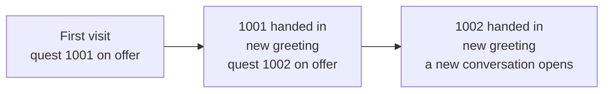

# A trader who gives quests — a worked example

> Needs **Dialogue Framework 1.4.0** or later. **DialogueForge 1.5.0** or later
> is recommended — its trader picker reads every trader map file you have.

One trader who talks, runs a shop, and hands out two quests in a row. The
second quest only opens once the first is handed in, the trader greets you
differently as you go, and a new line of conversation opens at the end.

The files are in
[`examples/TraderQuestChain`](../examples/TraderQuestChain). They are ready
to copy onto a server and run; this page explains every part, so you can
build your own chains from them.

- [What the player sees](#what-the-player-sees)
- [The files](#the-files)
- [Install and try it](#install-and-try-it)
- [Point it at your trader](#point-it-at-your-trader)
- [How it works](#how-it-works)
- [Building it in DialogueForge](#building-it-in-dialogueforge)
- [Moving your Expansion traders and quests over](#moving-your-expansion-traders-and-quests-over)
- [Changing the quest IDs](#changing-the-quest-ids)
- [Troubleshooting](#troubleshooting)

---

## What the player sees

The trader is a field medic using Expansion's standard **Medicals** trader.



The shop is one click away the whole time.

| Stage | The medic says | Buttons on the first screen |
|---|---|---|
| First visit | *Steady hands, clean tools, fair prices. What can I do for you?* | Show me what you're selling. · **Do you need a hand with anything?** · What is this place? · Nothing for now. |
| Quest 1001 taken | *(same)* | *(same)* — the quest button now opens the "still working on it" screen |
| Has the 3 rags | *(same)* | *(same)* — the quest button now opens the hand-in screen |
| **1001 handed in** | *Back again? Those rags have already patched up two people. Thank you.* | Show me what you're selling. · **Is there anything else I can do?** · What is this place? · Nothing for now. |
| Quest 1002 taken / has the apples | *(same)* | *(same)* — in progress, then hand-in |
| **1002 handed in** | *There's my favourite volunteer. The ward hasn't looked this good all year.* | Show me what you're selling. · **How are your patients doing?** · What is this place? · Nothing for now. |

| Quest | Title | Asks for | Pays |
|---|---|---|---|
| 1001 | Clean Dressings | 3 rags | 250 Hryvnia |
| 1002 | Fresh Fruit | 2 apples — only after 1001 | 500 Hryvnia and a bandage |

---

## The files

The example's `Profiles` folder is laid out like a server profile folder
(the one your server's `-profiles=` points at). Each file goes to the same
place in yours.

| File | What it is |
|---|---|
| `ExpansionMod/Quests/Quests/Quest_1001.json` | Expansion quest *Clean Dressings* |
| `ExpansionMod/Quests/Quests/Quest_1002.json` | Expansion quest *Fresh Fruit* |
| `ExpansionMod/Quests/Objectives/Collection/Objective_C_1001.json` | Its objective: bring 3 rags |
| `ExpansionMod/Quests/Objectives/Collection/Objective_C_1002.json` | Its objective: bring 2 apples |
| `DialogFramework/Dialogues/Trader_Medic/Dialogue.json` | The conversation |
| `DialogFramework/QuestText/TraderQuestChain.json` | *Optional.* The button wording on the quest screens |

The first four are ordinary Expansion quest files. Expansion loads any
`.json` in those folders, whatever it is called. The last two belong to
Dialogue Framework.

---

## Install and try it

1. **Check the IDs are free.** You need:
   - quests **1001** and **1002**;
   - collection objectives **1001** and **1002**;
   - no existing quest wording for 1001 or 1002.

   If any of those are already used, see
   [Changing the quest IDs](#changing-the-quest-ids).
2. **Stop the server** and copy the contents of `Profiles` into your server
   profile folder.
3. **Start the server, then fully restart the game.** A reconnect is not
   enough — conversations are sent when you connect.
4. Check for errors in two places:
   - `DialogFramework\Dialogues\LoadLog.txt`
   - the server script log, for anything mentioning quest or objective
     1001/1002.
5. Walk up to a **Medicals** trader and talk.

> **As shipped, the conversation attaches to every trader that uses the
> Medicals definition.** That is handy for a first look, but do the next
> section before you use it for real. If a Medicals trader already has a
> conversation of its own, that one may win — try the example on a trader
> without one.

---

## Point it at your trader

A trader has no NPC ID, so a conversation finds its trader by up to three
**keys**:

- the trader definition name (`TraderIDs`);
- the entity class (`TraderClassNames`);
- the position (`TraderPositions`).

`TraderMinKeyMatches` says how many of the keys must agree. The example only
fills in the definition name, which is why it matches every Medicals trader.

### With DialogueForge (easiest)

1. **Open** `Dialogue.json` with **Open file...**, or double-click it on the
   **Server files** tab.
2. On **Dialogue → Who it's for & voice lines**, press
   **Pick from trader map...** and choose your trader.
   - Forge reads every trader map in your mission's `expansion\traders`
     folder and fills in all three keys and **Keys that must agree** for you.
   - If you keep one map file per trader zone, use the **Map file** filter to
     find the right zone.
   - **Change map...** goes back if Forge is reading the wrong mission.
3. Change **Folder name** if you like — it is only your label — and **Save**.

### By hand

Open that trader in game once. The client log prints the three values:

```
[DialogueFramework] [TRADER] Trader opened -- name='Medicals' class='ExpansionTraderAIIrena' position='6616.0 8.38 2434.0'
```

Put them into the conversation file:

```json
"TraderIDs": ["Medicals"],
"TraderClassNames": ["ExpansionTraderAIIrena"],
"TraderPositions": ["6616.0 8.38 2434.0"],
"TraderPositionRadius": 8.0,
"TraderMinKeyMatches": 2,
```

Use `2` for `TraderMinKeyMatches`, or `3` if another trader shares both that
class and that definition — then only the position tells them apart.

**One conversation per trader.** If your trader already has one, merge the
example's nodes into it (or move the old file out) rather than keeping both.

### If the trader doesn't exist yet

The example attaches to a trader you have already placed. A conversation only
talks to a trader — what puts the character in the world is one line in a
trader map file.

1. Create or open a file in
   `mpmissions\<your mission>\expansion\traders\`. Any name ending in `.map`
   will do: Expansion loads every one of them, so a file per trader zone is
   fine.
2. Add one line per trader:

   ```
   ExpansionTraderAIIrena.Medicals|6616.0 8.38 2434.0|180 0 0|name:Vera,loadout:NBCLoadout,faction:Guards
   ```

   | Part | What it is |
   |---|---|
   | `ExpansionTraderAIIrena` | The entity class. `ExpansionTraderAI*` classes need Expansion AI; without it use a plain one such as `ExpansionTraderDenis`, or a static trader object. |
   | `Medicals` | The trader definition — the file `ExpansionMod\Traders\Medicals.json`. If there is no such file the log says `Trader does not exist: Medicals`. |
   | `6616.0 8.38 2434.0` | Where it stands. Write just `x z` (`6616.0 2434.0`) and Expansion puts it on the ground for you. |
   | `180 0 0` | Yaw, pitch and roll — which way it faces. |
   | `name:Vera,...` | Optional: the display name, plus `loadout:` and `faction:` for AI traders. |

3. **The spot has to be inside a trader zone** — one of
   `mpmissions\<your mission>\expansion\traderzones\*.json`. Outside one, the
   server log says `Trader is not within a trader zone` and the shop won't
   work properly.
4. Restart the server. The new trader then shows up in DialogueForge's
   **Pick from trader map...** list, so the conversation can be attached to it
   in one click.

A line you can edit is in
[`OptionalNewTrader.map.txt`](../examples/TraderQuestChain/OptionalNewTrader.map.txt).
Change the position (and the definition name, if yours differs), then save it
into that folder as a `.map` file — drop the `.txt`, and don't leave comment
lines in it, because Expansion reads every line as a trader.

> If you use the short `x z` form, DialogueForge will say the position has no
> height and fill in only the definition name and entity class. That is fine —
> or open the trader in game once and paste the full position from the client
> log.

---

## How it works

There are two halves:

- **Expansion's quest files** decide what each quest is and which quest
  unlocks which.
- **The conversation** decides what the trader says and which buttons appear.

### How the mod knows how far the player has got

It asks Expansion. Every time a conversation screen is built, the mod reads
the player's own quest state from Expansion:

- *not started*
- *in progress*
- *ready to hand in*
- *completed*

There is nothing extra to store or set up.

**DialogueForge never checks any of this.** It is only the editor: it writes
the files below. The checking happens in game, in the mod, using Expansion's
own record of that player's quests.

**Completed means handed in.** Collecting the items makes a quest *ready*,
not *completed*.

### 1 · The quests (Expansion's side)

The fields that matter in `Quest_1001.json` and `Quest_1002.json`:

| Field | 1001 | 1002 | What it does |
|---|---|---|---|
| `ID` | `1001` | `1002` | The number the conversation refers to. |
| `Descriptions` | 3 lines | 3 lines | What the trader says on the quest screens: `[0]` offer, `[1]` in progress, `[2]` hand-in. |
| `PreQuestIDs` | `[]` | `[1001]` | **This is what links the two quests.** 1002 can't be taken until 1001 is completed. Expansion checks this, and so does the mod before it shows an accept button. |
| `QuestGiverIDs` | `[-1]` | `[-1]` | No quest NPC gives these — the trader does. **Must not be empty.** |
| `QuestTurnInIDs` | `[-1]` | `[-1]` | They are handed back at the trader. **Must not be empty.** |
| `Repeatable` | `0` | `0` | Once per player. The buttons below swap over on *completed*, so this matters. |
| `Autocomplete` | `0` | `0` | The player has to bring the items back to the trader. |
| `FollowUpQuest` | `-1` | `-1` | Not needed — `PreQuestIDs` does the chaining. |
| `Objectives` | `ID 1001, ObjectiveType 4` | `ID 1002, ObjectiveType 4` | Type 4 is a **collection** objective, in `Objectives\Collection`. |
| `Rewards` | 250 Hryvnia | 500 Hryvnia, 1 bandage | Paid when the trader takes the quest back. Swap in your server's currency. |

The objective files are short. `Collections` lists what to bring:

- A stack counts by its size, so one stack of three rags is enough.
- `"ShowDistance": 0` because there is no quest NPC to measure the distance
  to.

> **Two settings that catch everyone out**
>
> - **An empty `QuestGiverIDs`** (with no `PreQuestIDs`) tells Expansion the
>   quest starts by itself. **Every player gets it the moment they log in.**
> - **An empty `QuestTurnInIDs`** makes Expansion open its own hand-in window
>   as soon as the items are collected, so the player never needs to go back
>   to the trader.
>
> `-1` matches no NPC, so it avoids both problems. Dialogue Framework's
> quest actions don't care who the giver is.

### 2 · The conversation (Dialogue Framework's side)

`Dialogue.json` has four nodes. Node 1 is the first screen:

| Button | `ActionType` | `QuestID` | `RequiredQuestID` | `HideAfterQuestID` | Shown |
|---|---|---|---|---|---|
| Show me what you're selling. | `OPEN_TRADER` | | | | always |
| Do you need a hand with anything? | `OFFER_QUEST` | 1001 | | 1001 | until 1001 is handed in |
| Is there anything else I can do? | `OFFER_QUEST` | 1002 | 1001 | 1002 | after 1001, until 1002 is handed in |
| How are your patients doing? | `NONE` → node 3 | | 1002 | | after 1002 |
| What is this place? | `NONE` → node 2 | | | | always |
| Nothing for now. | `END_CONVERSATION` | | | | always |

An empty cell means the field is left out, which is the same as `-1`
(nothing set).

- **One `OFFER_QUEST` button runs a whole quest.** It opens a different
  screen depending on where the player is:

  | Player's state | Screen that opens |
  |---|---|
  | not started | the **offer**, with accept and decline |
  | in progress | a **"still working on it"** screen |
  | ready | the **hand-in**, which takes the items and pays out |

  You don't need a separate `TURN_IN_QUEST` button. Because one button covers
  all three screens, give it text that reads well at every stage.

  From **1.5.0** you can instead give the hand-in a button of its own that
  appears only once the player has everything. Use `TURN_IN_QUEST` with
  `ShowWhileQuestID: 1001` and `ShowWhileQuestState: "READY"`, which is
  **Only while** in DialogueForge. The example keeps to one button so it runs
  on 1.4.0 too.
- **`RequiredQuestID`** shows a button only once that quest is completed.
  **`HideAfterQuestID`** hides it once that quest is completed. Setting both
  on the 1002 button gives it a window: it appears after 1001 and goes away
  after 1002.
- **The greeting changes** through `SpeakerLines` on node 1. Each extra line
  has an `OverrideQuestID`. Once that quest is completed, the line replaces
  the normal greeting, and the highest completed quest wins.
- **The next part of the story** is the *How are your patients doing?*
  button (`RequiredQuestID: 1002`). It leads to nodes 3 and 4, which the
  player can't reach before then.
  - Node 4 is where a third quest would go: an `OFFER_QUEST` button for 1003
    with `RequiredQuestID: 1002`.
  - Give `Quest_1003.json` `"PreQuestIDs": [1002]`.
- **The shop stays open.** Every node has an `OPEN_TRADER` button, so the
  player is never more than a click from trading.

For a bigger change after a quest — a whole different conversation rather
than a few swapped buttons — see
[Quest-locked trees](DIALOGUE_TREE_GUIDE.md#quest-locked-trees).

### 3 · Quest wording (optional)

`TraderQuestChain.json` sets the player's buttons on each quest's screens:

- accept and decline on the offer;
- the "still working on it" button;
- hand in / not yet on the hand-in screen;
- a **Back** button on all three that returns to the first screen.

Without this file the mod uses its built-in wording (*I'll take it.*,
*Not interested.* and so on), and the quest screens have no way back except
closing the window.

---

## Building it in DialogueForge

DialogueForge writes the conversation and the quest wording. It doesn't write
Expansion's quest files — copy the example ones and edit them as described
above.

1. **Expansion quests (optional)** at the top of the window: point it at your
   `ExpansionMod\Quests` folder. Quest fields then become dropdowns with the
   quest names.
2. **New (blank)**, then set up **Dialogue → Who it's for & voice lines**:
   - choose **A trader**;
   - press **Pick from trader map...** and choose your trader.
3. **Dialogue → Flow**, node 1:
   - Type the normal greeting in **What the NPC says here**.
   - Under **Extra spoken lines (optional)**, press **Add line**, type the
     new greeting and set **Standard greeting after** to quest 1001.
   - Add another line the same way for 1002.
4. **Add option** for each button:
   - Set **Button text** and **What it does**.
   - For `OFFER_QUEST`, set **Quest to use**.
   - For `NONE`, set **Next node**.
   - Set **Quest lock** and **Hide after** under
     **Show / hide based on quest (optional)**.
5. **Add node** for the small talk and for the follow-up conversation.
6. **Quest wording** tab: add quest 1001, fill in the accept, decline,
   in-progress and hand-in buttons and the **Back to the conversation**
   buttons, then do the same for 1002.
7. **Save**, then press **Check ALL config files**.
8. **Quest flow report** on the **Server files** tab lists the whole chain.
   For the example it reads:

   ```
   Quest 1001  Clean Dressings
       offered by         Dialogues\Trader_Medic\Dialogue.json  node 1, option 2   "Do you need a hand with anything?"
       shown after        Dialogues\Trader_Medic\Dialogue.json  node 1, option 3   "Is there anything else I can do?"
       hidden after       Dialogues\Trader_Medic\Dialogue.json  node 1, option 2   "Do you need a hand with anything?"
       takes over after   Dialogues\Trader_Medic\Dialogue.json  node 1, alternate line 1   "Back again? Those rags have already patched..."
   ```

Opening the example in DialogueForge and saving it again changes nothing, so
the example files are also a safe starting point for your own.

---

## Moving your Expansion traders and quests over

A checklist for turning existing Expansion traders and quest NPCs into
characters that talk.

- **Traders keep working as they are.**
  - A trader with no conversation opens its shop exactly as before.
  - Add conversations one trader at a time.
- **Quests a trader should give and take back:**
  - Set `QuestGiverIDs` and `QuestTurnInIDs` to `[-1]` instead of the old
    quest NPC IDs.
  - Keep `PreQuestIDs` as they are — your chains carry over unchanged.
  - Give the trader one `OFFER_QUEST` button per quest.
- **Use collection objectives for "bring me something" quests.**
  - **Delivery objectives need a real quest NPC** in `QuestTurnInIDs`: they
    check the player is standing next to one. With `-1` they never complete,
    and Expansion shows the player an error instead.
  - Travel, target and collection objectives don't care who the quest is
    handed in to.
- **Quest NPCs you keep** can have conversations too.
  - Put the file in `Dialogues\NPC_<id>\`.
  - `SHOW_QUEST_LIST` there opens that NPC's own quest list. It only works on
    quest NPCs.
- **Player progress is kept.**
  - Expansion stores it by quest ID, so changing who gives a quest doesn't
    reset anyone.
  - A player already on a quest can hand it in at the trader straight away.
- **Test on a character that hasn't done the quests yet**, then check
  `LoadLog.txt` and your server log after every restart.

---

## Changing the quest IDs

If 1001 or 1002 are already taken, pick free numbers and change them
everywhere. Expansion refuses a second quest or objective with the same ID.

| File | Change |
|---|---|
| `Quest_1001.json`, `Quest_1002.json` | `ID`, the `ID` inside `Objectives`, and 1002's `PreQuestIDs` |
| `Objective_C_1001.json`, `Objective_C_1002.json` | `ID` |
| `Dialogue.json` | every `QuestID`, `RequiredQuestID`, `HideAfterQuestID` and `OverrideQuestID` |
| `TraderQuestChain.json` | each `QuestID` |

Objective IDs only have to be unique among objectives of the same type. The
file names don't matter to either mod.

---

## Troubleshooting

| What you see | What to check |
|---|---|
| The trader opens the shop straight away | The conversation didn't match. Compare the `Trader opened` line in the client log with the three keys, and check `LoadLog.txt`. |
| Every player has *Clean Dressings* as soon as they log in | `QuestGiverIDs` is empty. Set it to `[-1]`. |
| Expansion's quest window pops up when the items are collected | `QuestTurnInIDs` is empty. Set it to `[-1]`. |
| The offer screen has no accept button, or *"You can't take that quest right now."* | The player can't take it yet: already done, already on it, or 1001 not handed in. |
| A quest button never appears | Its `RequiredQuestID` quest hasn't been handed in yet. Collected isn't completed. |
| A button never goes away | Its `HideAfterQuestID` quest hasn't been handed in, or the quest is `Repeatable`. |
| A delivery quest never completes | Delivery objectives need a real quest NPC — see [the checklist](#moving-your-expansion-traders-and-quests-over). |
| The server log says an objective doesn't exist | The objective file is in the wrong folder (collection objectives go in `Objectives\Collection`), or its `ID` doesn't match the quest's `Objectives` entry. |
| The log says `Trader does not exist: <name>` | The name after the dot in the `.map` line has no matching file in `ExpansionMod\Traders\`. |
| The log says `Trader is not within a trader zone` | The trader's position is outside every zone in `expansion\traderzones`. Move it, or widen the zone. |
| Nothing changes after editing | Restart the server **and** fully restart the game. |

More on every field: [Dialogue Tree Authoring Guide](DIALOGUE_TREE_GUIDE.md).
